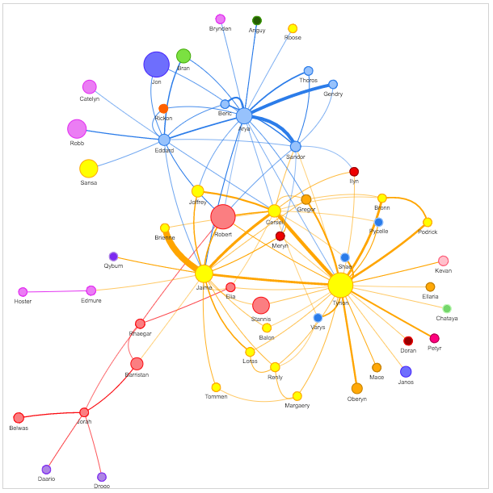

# neovis.js

[]()[](https://badge.fury.io/js/neovis.js)

Graph visualizations powered by vis.js with data from Neo4j.



## Features

- [x] Connect to Neo4j instance to get live data
- [x] User specified labels and property to be displayed
- [x] User specified Cypher query to populate
- [x] Specify node property for url of image for node
- [x] Specify edge property for edge thickness
- [x] Specify node property for community / clustering
- [x] Specify node property for node size
- [x] Configure popover

## Install

Neovis.js can be installed via npm:

```bash
npm install --save neovis.js
```

you can also obtain neovis.js via CDN:

## CDN

For ease of use Neovis.js can be obtained from Neo4jLabs CDN:

*Most recent release*

```html

<script src="https://unpkg.com/neovis.js@2.0.2"></script>
```

*Version without neo4j-driver dependency*

```html

<script src="https://unpkg.com/neovis.js@2.0.2/dist/neovis-without-dependencies.js"></script>
```

## Quickstart Example

Let's go through the steps to reproduce this visualization:


### Prepare Neo4j

Start with a blank Neo4j instance, or spin up a blank [Neo4j Sandbox](https://neo4jsandbox.com). We'll load the Game of
Thrones dataset, run:

```cypher

LOAD CSV WITH HEADERS FROM 'https://raw.githubusercontent.com/mathbeveridge/asoiaf/master/data/asoiaf-all-edges.csv'
AS row
MERGE (src:Character {name: row.Source})
MERGE (tgt:Character {name: row.Target})
MERGE (src)-[r:INTERACTS]->(tgt)
  ON CREATE SET r.weight = toInteger(row.weight)
```

We've pre-calculated PageRank and ran a community detection algorithm to assign community ids for each Character. Let's
load those next:

```cypher

LOAD CSV WITH HEADERS FROM 'https://raw.githubusercontent.com/johnymontana/neovis.js/master/examples/data/got-centralities.csv'
AS row
MATCH (c:Character {name: row.name})
SET c.community = toInteger(row.community),
c.pagerank = toFloat(row.pagerank)
```

Our graph now consists of `Character` nodes that are connected by an `INTERACTS` relationships. We can visualize the
whole graph in Neo4j Browser by running:

```cypher

MATCH p = (:Character)-[:INTERACTS]->(:Character)
RETURN p
```


We can see characters that are connected and with the help of the force directed layout we can begin to see clusters in
the graph. However, we want to visualize the centralities (PageRank) and community detection results that we also
imported.

Specifically we would like:

* Node size to be proportional to the Character's `pagerank` score. This will allow us to quickly identify important
  nodes in the network.
* Node color to determined by the `community` property. This will allow us to visualize clusters.
* Relationship thickeness should be proportional to the `weight` property on the `INTERACTS` relationship.

Neovis.js, by combining the JavaScript driver for Neo4j and the vis.js visualization library will allow us to build this
visualization.

### index.html

Create a new html file:

```html
<!doctype html>
<html>
<head>
    <title>Neovis.js Simple Example</title>
    <style type="text/css">
        html, body {
            font: 16pt arial;
        }

        #viz {
            width: 900px;
            height: 700px;
            border: 1px solid lightgray;
            font: 22pt arial;
        }
    </style>
</head>
<body onload="draw()">
<div id="viz"></div>
</body>
</html>

```

We define some basic CSS to specify the boundaries of a `div` and then create a single `div` in the body. We also
specify `onload="draw()"` so that the `draw()` function is called as soon as the body is loaded.

We need to pull in `neovis.js`:

```html

<script src="https://unpkg.com/neovis.js@2.0.2"></script>
```

And define our draw() function:

```html

<script type="text/javascript">

    let neoViz;

    function draw() {
        const config = {
            containerId: "viz",
            neo4j: {
                serverUrl: "bolt://localhost:7687",
                serverUser: "neo4j",
                serverPassword: "sorts-swims-burglaries",
            },
            labels: {
                Character: {
                    label: "name",
                    value: "pagerank",
                    group: "community",
                    [NeoVis.NEOVIS_ADVANCED_CONFIG]: {
                        function: {
                            title: (node) => viz.nodeToHtml(node, [
                                "name",
                                "pagerank"
                            ])
                        }
                    }
                }
            },
            relationships: {
                INTERACTS: {
                    value: "weight"
                }
            },
            initialCypher: "MATCH (n)-[r:INTERACTS]->(m) RETURN *"
        };

        neoViz = new NeoVis.default(config);
        neoViz.render();
    }
</script>
```

This function creates a `config` object that specifies how to connect to Neo4j, what data to fetch, and how to configure
the visualization.


See [simple-example.html](/examples/simple-example.html) for the full code.

### module usage

you can also use it as module, but it would require you have a way to import css files

```javascript
import NeoVis from 'neovis.js';
```

or you can import the version with bundled dependency

```javascript
import NeoVis from 'neovis.js/dist/neovis.js';
```

## Api Reference

[Api Reference](https://neo4j-contrib.github.io/neovis.js/modules.html)

## Build

This project uses git submodules to include the dependencies for neo4j-driver and vis.js. This project uses webpack to
build a bundle that includes all project dependencies. `webpack.config.js` contains the configuration for webpack. After
cloning the repo:

```bash
npm install
npm run build
npm run typedoc
```

will build `dist/neovis.js` and `dist/neovis-without-dependencies.js` 


